# PiReplay

<a href="https://github.com/gruvw/pireplay/releases/latest" target="_blank"></a>

Capture a video and instantly replay the last moments from your phone or computer.

<p align="center">
  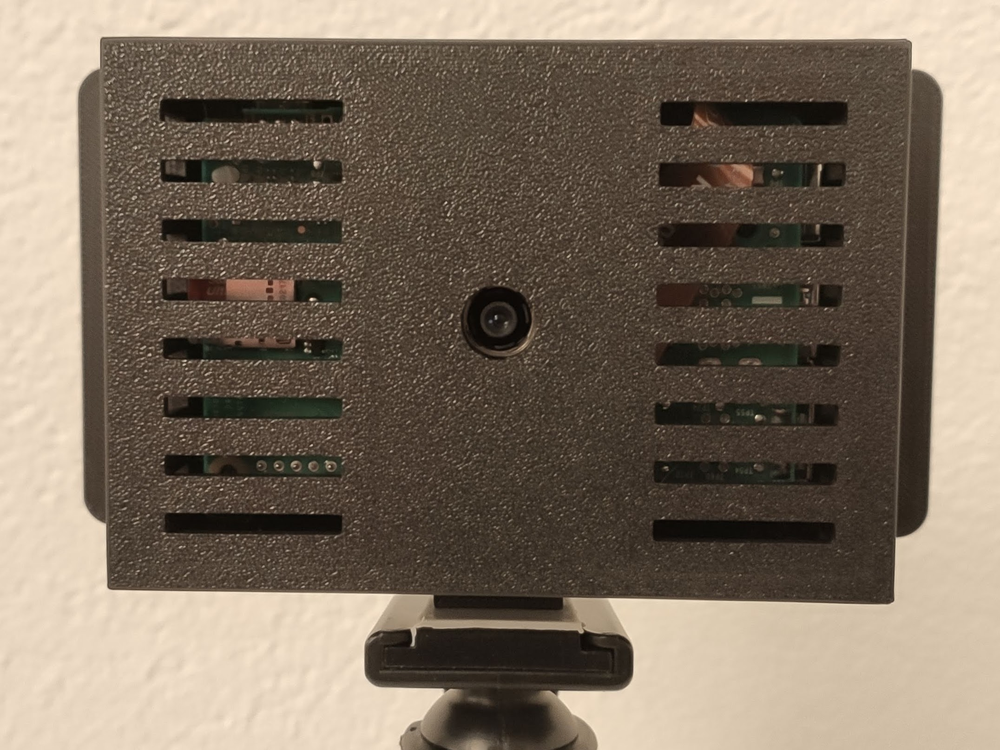
</p>

PiReplay is a device that allows you to instantly record and replay the past 5 to 60 seconds of real-life events directly from your phone or computer.
This has unlimited applications but is primally useful when analyzing a key moment in sports, reviewing gameplay, or simply reliving funny moments.
You simply press a button and instantly get a video of the last few seconds that just happened - live replay, IRL.

The device comes in two variants:

<table>
  <tr>
    <td>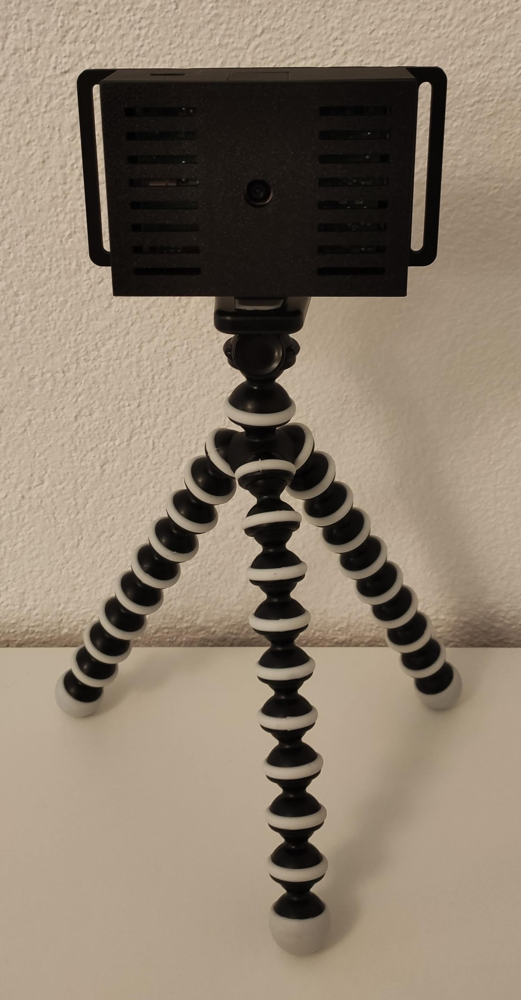</td>
    <td>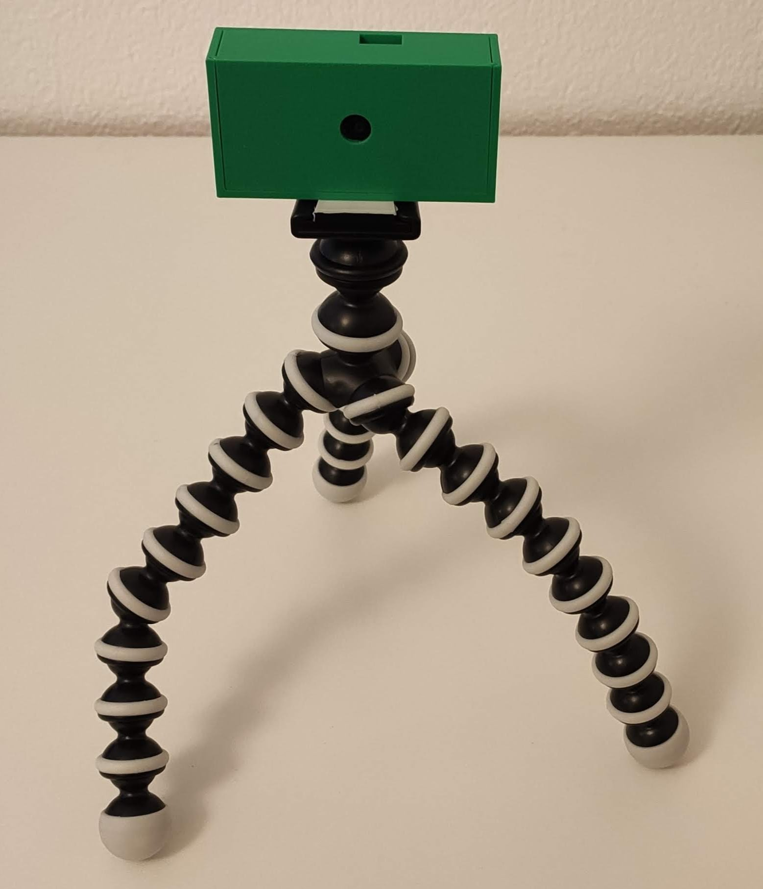</td>
  </tr> 
  <tr>
    <td align="center">PiReplay</br>~100x75x45mm</td>
    <td align="center">PiReplay Mini</br>~80x40x25mm</td>
  </tr> 
</table>

You can capture replays from a locally hosted web application `pireplay.local`, which controls a [Raspberry Pi](https://www.raspberrypi.com) with a camera.

Take a look at the project's [roadmap](docs/roadmap.md) to see upcoming features (along with all the work accomplished).

**Note** - Check out the `pireplay` [Python](https://www.python.org) package (CLI) on PyPI: <https://pypi.org/project/pireplay> (managed using [Poetry](https://python-poetry.org/)).

## User Guide

1. Make sure you stand close to a running PiReplay device.
2. Using your phone or computer, connect to the PiReplay Wi-Fi network, usually named `PiReplay-XXXX` (the default password is `pireplay42`).
3. Open a web browser and navigate to the following URL `http://pireplay.local` or `http://10.42.0.1` (you might need to accept security warning).
4. Congratulations, you can now use the Web interface to capture, watch and download live replays!

Features:

- Press the **CAPTURE** button to save an instant replay save (you might need to wait a few seconds after pressing the button for the page to reload, avoid double pressing the CAPTURE button).
- Browse and watch past replays.
- Download replays directly to your phone or computer for saving and sharing them.
- Access the settings page to change the replay duration and camera resolution.
- Snapshot picture in the settings page for camera positioning.
- Vertical/horizontal videos support
- RESTful API to interoperate with other components of your digital system.

### User Interface

Web user interface from a phone:

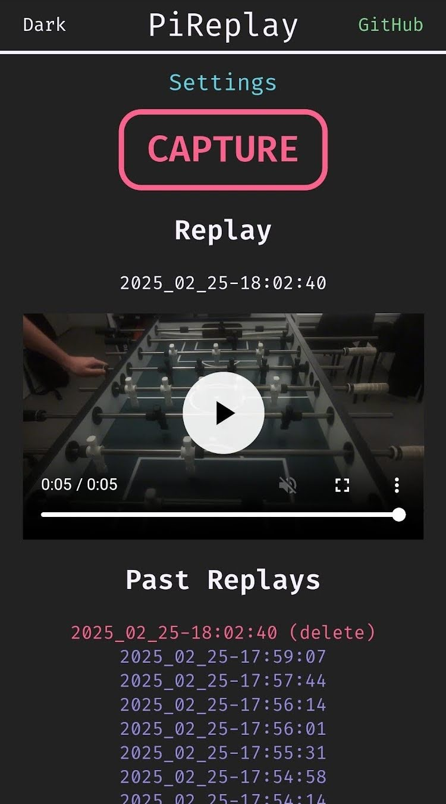 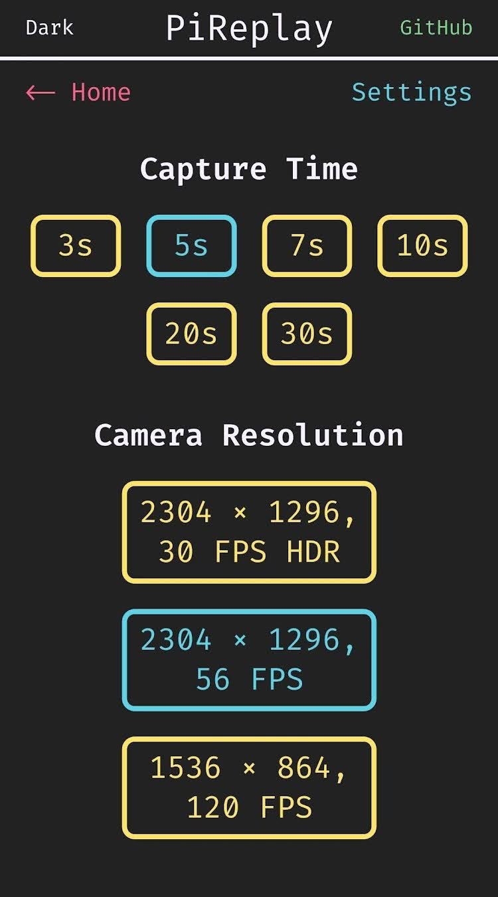 

## Project Structure

A brief overview of the project's structure for quick reference:

- [`cad`](./cad/): for 3D models files, 3D printing (case)
- [`src`](./src/): the source code of the Python `pireplay` package

## Do It Yourself

Follow these instructions (tutorial) for setting up a fully functional **PiReplay** device.

**PiReplay vs. PiReplay Mini**

The PiReplay Mini (~4 times smaller) was introduced into the project as a fun and compact alternative when space-constrained applications.
However, it uses a smaller, resource limited microcomputer, making it not the best choice to perform high resolution video processing.
Therefore, I recommend building the standard version of the PiReplay if space isn't a concern.

### Requirements

- Raspberry Pi board (recommended board: `Raspberry Pi 5 4GB` for PiReplay, or `Raspberry Pi Zero 2 W` for PiReplay Mini)
- Cooling system (optional, better for the `Raspberry Pi 5`: Raspberry Pi Active Cooler for Pi 5)
- Micro SD card (at least 64 GB)
- Raspberry Pi Camera module 3 (regular 75° sensor)
- CSI Camera FPC connector cable to Raspberry Pi (select the correct one depending on you Raspberry Pi board)
- Raspberry Pi power supply (Micro USB/USB type C), ensuring sufficient voltage
- PiReplay box (see below), 3D printer
- A 1/4"-20 UNC nut (optional, for mounting on a camera tripod)

### PiReplay box

You can 3D print the corresponding enclosure for the PiReplay device.

### PiReplay

For the standard variant of the PiReplay (using the `Raspberry Pi 5`), choose one of the following base options:

- With a standard tripod camera mount (1/4"-20 UNC): [`./cad/pireplay/PiReplay-base_camera_mount.stl`](./cad/pireplay/PiReplay-base_camera_mount.stl)
- With rail screw mounts: [`./cad/pireplay/PiReplay-base_screw_mount.stl`](./cad/pireplay/PiReplay-base_screw_mount.stl)

The top cover piece is common for both:

- For horizontal videos: [`./cad/pireplay/PiReplay-cover.stl`](./cad/pireplay/PiReplay-cover.stl).
- For vertical videos: [`./cad/pireplay/PiReplay-cover-vertical.stl`](./cad/pireplay/PiReplay-cover-vertical.stl).

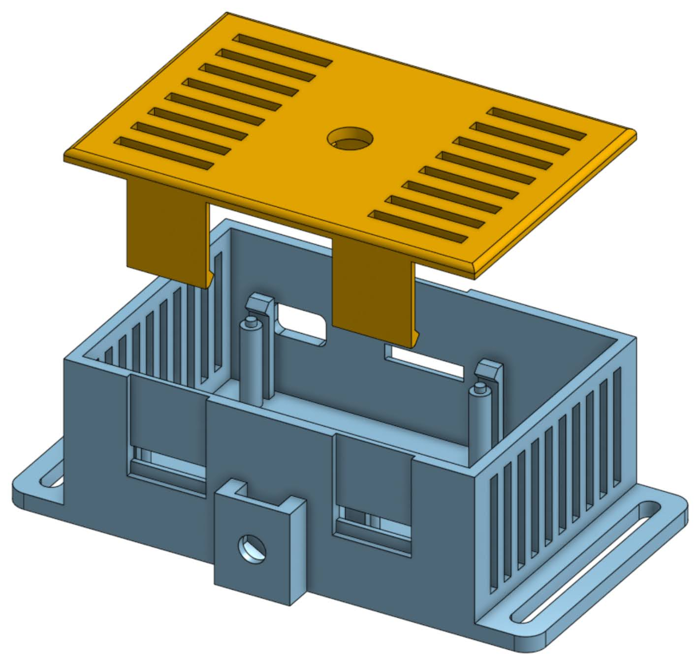

**Note** - This print is specifically designed to clip and assemble together, with no additional screws or glue needed. The Raspberry Pi board clips into place, the camera & nut slide into place (held by friction), and the cover snaps onto the base like a buckle clip.

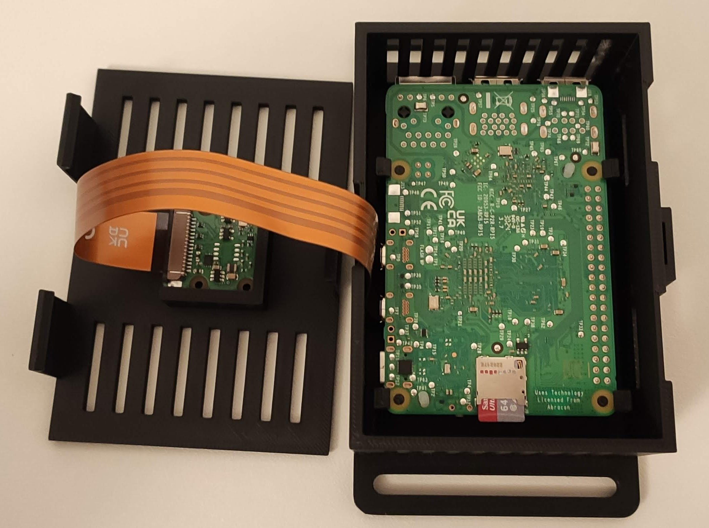 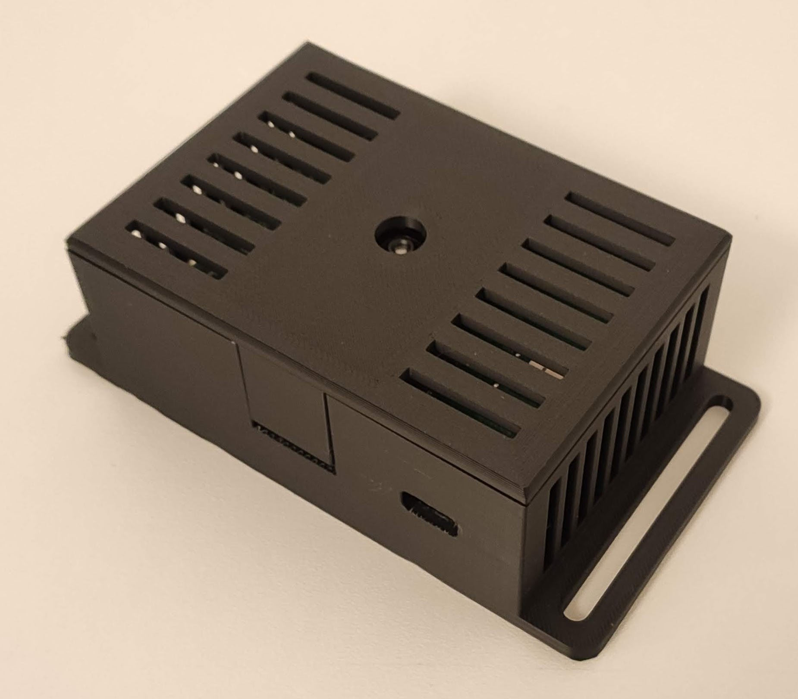

### PiReplay Mini

For the PiReplay Mini, you need to print the base and the cover:

- Base: [`./cad/pireplay_mini/PiReplay_mini-base.stl`](./cad/pireplay_mini/PiReplay_mini-base.stl)
- Cover for horizontal videos: [`./cad/pireplay_mini/PiReplay_mini-cover.stl`](./cad/pireplay_mini/PiReplay_mini-cover.stl)
- Cover for vertical videos: [`./cad/pireplay_mini/PiReplay_mini-cover-vertical.stl`](./cad/pireplay_mini/PiReplay_mini-cover-vertical.stl)

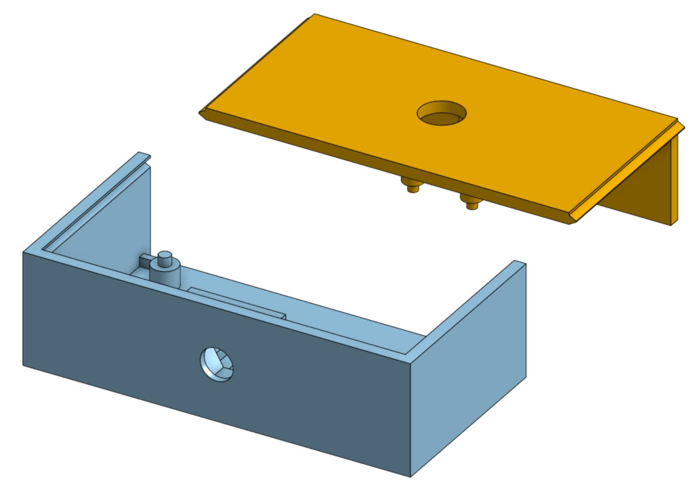

**Note** - The Mini version is designed for minimal space usage. You may need glue to secure the parts and keep the case closed.

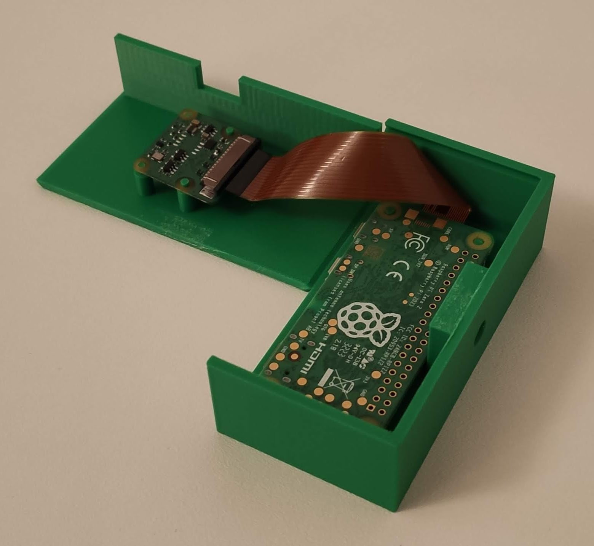 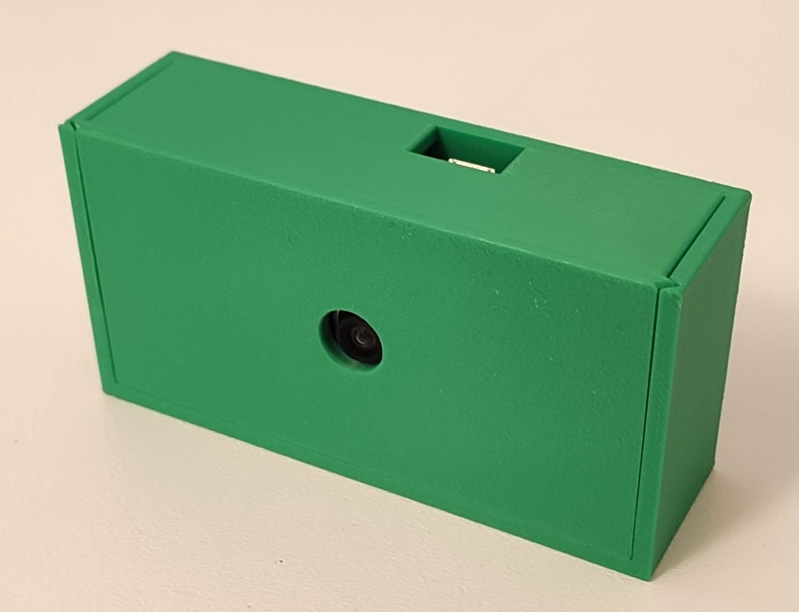

### Quick Raspberry Pi Basic Setup

Install and configure Raspberry Pi OS for PiReplay on the board:

1. Download and install the Raspberry Pi OS Imager: <https://www.raspberrypi.com/software/>
2. Connect the SD card to your computer and flash the OS on the card using Raspberry Pi OS Imager
    1. _Raspberry Pi Device_: select your correct device (`Raspberry Pi 5`, `Raspberry Pi Zero 2 W`, ...)
    2. _Operating System_:  Raspberry Pi OS (other) > `Raspberry Pi OS Lite (64-bit)`
    3. _Storage_: Select SD card
    4. _Next_ > Edit Settings (additional configuration)
        - General > Set hostname: `pireplay.local`
        - General > Set username and **password**: `pireplay` (use a secure password)
        - General > Configure wireless LAN: use your current Wi-Fi network credentials (only for setup purposes, we will use a Wi-Fi Hotspot configuration later).
        - Services > Enable SSH (using password authentication)
    5. Flash the SD card and wait till it completes
3. Insert the SD card inside the Raspberry Pi and power it using the micro USB cable (wait a few seconds)
4. Connect to your Raspberry Pi using an SSH client (on the same Wi-Fi network credentials used in the configuration)
    - You can connect using [Putty](https://www.putty.org/), or simply running `ssh` from your terminal
    - Connect using `pireplay@pireplay.local` as the host (use port 22)
    - Enter the password you specified in Pi OS Imager during configuration

You are now connected via SSH to your newly setup Raspberry Pi for PiReplay.

### PiReplay Software Setup

After connecting to the Raspberry Pi via SSH, you can install and configure the `pireplay` software to run on it.

```bash
sudo apt update
sudo apt upgrade -y

sudo apt install -y python3-picamera2 --no-install-recommends
sudo apt install -y ffmpeg python3-pip

sudo pip install pireplay --break-system-packages # or build/install from source

(crontab -l 2>/dev/null; echo "@reboot sudo pireplay run") | crontab -

sudo reboot
```

Congratulations! Your PiReplay device is now fully functional.

#### Build from source

Build and install the package from source (on the Raspberry Pi) using the following:

```bash
git clone https://github.com/gruvw/pireplay
cd pireplay/src
poetry build
sudo pip install dist/pireplay-X.X.X.tar.gz --break-system-packages
```

**Note** - Requires [Poetry](https://python-poetry.org/).

### Configuration

You can configure some options of the `pireplay` program by providing a [YAML](https://yaml.org/) configuration file to the CLI: `pireplay run --config /path/to/config.yaml`.

Check the documented default config file as an example: [`./src/pireplay/default_config.yaml`](./src/pireplay/default_config.yaml).

**Note** - Vertical video rotation (when using the vertical camera attachement cover variant) must be explicity set in the config file.

### API

If you wish to integrate PiReplay into a larger system (like streaming, robotics, ...), there is an API to access its functionality from other programs or scripts.

Main endpoints:

- `/capture` (POST): triggers a replay capture, sends the raw replay URL in the `Raw-Replay` response (redirect) header.
- `/raw-replay/<replay_name>.mp4` (GET): access video file of a given replay.
- `/snapshot` (POST): triggers an instantaneous snapshot picture, sends raw snapshot URL in `Raw-Snapshot` response (redirect) header.
- `/raw-snapshot.jpg` (GET): the jpg picture of the instantaneous snapshot.
- `/settings/capture-time` (POST, form data `index` set to the index of capture time options, see configuration file): changes the replay duration.
- `/delete-replay` (POST, form data `replay` set to `<replay_name>`): deletes a given replay.
- `/delete-all-replays` (POST): deletes every replay.

### Troubleshooting

If you encounter network issues on your device, you might want to use SSH over USB to fix them.
Follow this tutorial to enable SSH over USB: <https://gist.github.com/gruvw/97da6d772d5248d8178822b03f6975fd>.

## Contributions

Feel free to contribute by submitting pull requests, whether to add new features, improve existing functionality, or fix bugs :)

Before opening a new PR, please open an issue to discuss it beforehand (check for existing issues first).

## Powered by

This project would not be possible without the wonderful technologies below:

* [Python](https://www.python.org/)
* [Flask](https://github.com/pallets/flask/)
* [Raspberry Pi](https://www.raspberrypi.com/)
* [picamera2](https://github.com/raspberrypi/picamera2)
